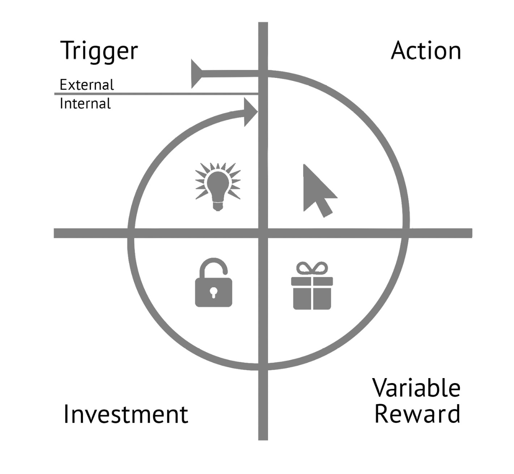
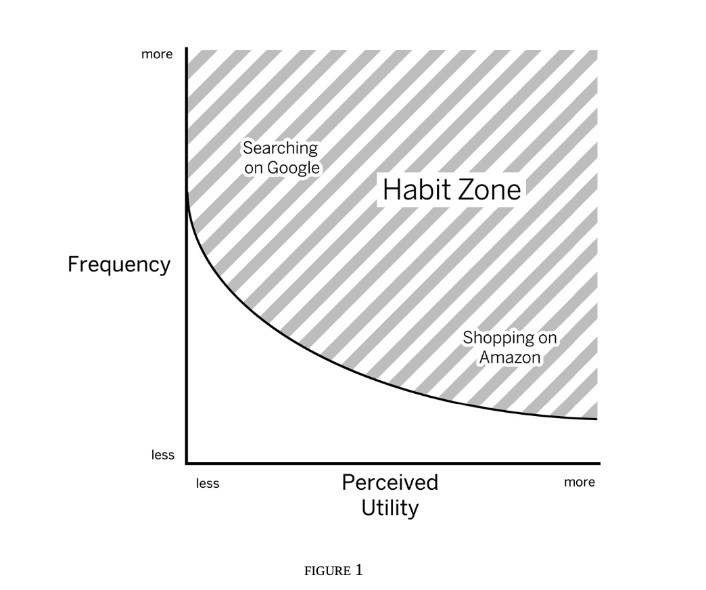

## Hooked: How to Build Habit-Forming Products  
*by Nir Eyal and Ryan Hoover*

---

### Introduction

> “Habits are automatic behaviors triggered by situational cues: things we do with little or no subconscious thought.”

**Q**: How do companies, producing little more than code, form such strong user habits?  
Because they:

- Attach their products to **internal triggers**
- Link services to users' **daily routines and emotions**
- Manufacture habits through repeated exposure to **hooks**

The more often users run through a hook cycle, the more likely they are to form a habit.

  

**Concepts:**  
Behavior Design, Consumer Psychology, Behavioral Economics, Choice Architecture

**Courses:**  
- Stanford – *Science of Influencing Human Behavior*
- Hasso Plattner Institute of Design

**Books, Research, Sites:**  
[NirAndFar.com](https://NirAndFar.com), [Choice Architecture](https://thedecisionlab.com/reference-guide/psychology/choice-architecture), [Behaviour Model](https://www.behaviormodel.org/motivation), [The Acceleration of Addictiveness](https://www.google.com/search?client=safari&rls=en&q=The+Acceleration+of+Addictiveness&ie=UTF-8&oe=UTF-8)

**People Mentioned:**  
Paul Graham, Dr. Baba Shiv, Dr. Steph Habif, Richard Thaler, Cass Sunstein, Eric Balz

---

### Chapter 1: The Habit Zone
> A habit is when not doing an action causes a bit of pain.

**Q**: Are you building a vitamin or a painkiller?

- Customers form routines around a product and become less price-sensitive
- Game developers delay asking for money until a habit is formed
- The “Smile Graph” shows that user engagement grows over time with repeated use
- Users invest time, data, effort, social capital, or money**, making it harder to leave
- Hooked users often become brand evangelists, promoting the product to others
- A product must be 10× better than what it's replacing to override old habits
- Behaviors are LIFO(Last In, First Out): new habits are fragile
- Algorithms improve with use → better product experience → more usage 
- Habit-forming potential = Frequency × Perceived Utility
- A habit forms when not doing something causes discomfort (the “itch”)

  

**Key Concepts:**  
CLTV (Customer Lifetime Value), Viral Cycle Time, Smile Graph, More-is-More Principle

**People Mentioned:**  
Phil Libin (Evernote), John Gourville, David Skok

---

### Chapter 2: Trigger
> “Triggers are signals that prompt you to take action..”

Triggers are the first step in the Hook Model:  
1. Trigger → 2. Action → 3. Variable Reward → 4. Investment

Example: A person feels bored (internal trigger), opens Instagram (action), sees stories of a friend (reward), sends a reaction (investment).

There are two types:

1. **External Triggers**  
Examples: push notifications, emails, app icons, ads  
It's a call-to-action button that invites the user to the app.
Types:
Types of Triggers:
- Paid Triggers -> an ad  
- Earned Triggers —> press mentions, viral content, interviews  
- Relationship Triggers —>  word of mouth or invites from friends  
- Owned Triggers —> emails, push notifications, or the app icon  
  Good for retention of the user. Prompt the user to repeat the engagement until a habit is formed.

2. **Internal Triggers**  
When a product becomes tightly coupled with a thought, emotion, or preexisting routine, it leverages an internal trigger.  
- Negative Examples: boredom, loneliness, fear, uncertainty, confusion, fomo.  
- Postivie Examples: happiness, sharing good news, feeling productive, curiosity, excitement, relief, accomplishment, connection. 

Users who find a product that alleviates their pain or gives them a pleasure will form a strong, positive association with a product.

> "Technology is a go-to solution for many of our daily agitations, from validating our importance (or even our existence) by checking to see if someone needs us, to providing an escape from life's mundane moments."

QQ: What pain does it solve? What does the user want to achieve by using it? What emotions influence their use and will trigger them to take action? (their desires, emotions, the context) 

**Key Concepts:**  
User Narratives, Customer Development, Usability Studies, Empathy Maps, Product Requirement.

**Books, Research, Sites:**  
Just Enough Research, Toyoto book.

**People Mentioned:**  
Evan Williams (Twitter), Jack Dorsey (Twitter,Square).

Do-this-now QQ: 
- Who is your product’s user?
- What is the user doing right before your intended habit?
- Come up with three internal triggers that could cue your user to action. 
- Which internal trigger does your user experience most frequently?
- Finish this brief narrative using the most frequent internal trigger and the habit you are designing: “Every time the user (internal trigger), he/she (first action of intended habit).”

---

### Chapter 3: Action
> "To initiate action, doing must be easier than thinking."

The Fogg Behaviour Model:
- Motivation : desire to take action.  
All humans are motivated to seek pleasure and avoid pain; to seek hope and avoid fear; to seek social acceptance and avoid rejection.
- Ability: easy to take action.  
Any tech that lets the user to achieve xyz/get job done in the shortest amount of steps will enjoy high adoption.
- Trigger

> "Take a human desire, preferable one that has been around for a very long time. Identify that desire and use modern technology to take out steps"

Elements of Simplicity (Fogg):
- Time
- Money
- Physical effort
- Mental effort
- Social acceptance
- Match existing routine

Designing with an idea to UX reduces friction, removes obstacles. The easier the action, the more likely the user is going to do it.  

People often multitask, don't read instructions, and have little patience for explanations about why or how to do xyz...So make your product so simple that users already know how to use it.  

Getting users to experience the service would yield better results than persuading them to use it.

Heuristics are quick ways our brain makes decisions without needing all the information. There are 4 brain biases:
- The Scarcity effect: the less there is, the more valuable it seems 
*Example:* “Only 2 left in stock!” makes people more likely to buy.
- The Framing effect: the way something is presented changes how we feel about it  
 *Example:* "90% fat-free" sounds better than "10% fat."
- The Anchoring effect: our brain likes a reference point.The first number or option we see shapes how we judge everything that comes after.  
*Example:* A menu shows a $100 steak, and then a $70 steak below it. The $70 option feels cheap in comparison, even if it's still pricey.
- The Endowed Progress Effect: when people feel like they've already made progress toward a goal, they're more likely to keep going
*Example:* Loyalty cards, Completion bars

**Key Concepts:**  
Heuristics, Cognitive Bias 

**Books, Research, Sites:**  
Something really new book, Seductive Interaction Design book

**People Mentioned:**  
Denis J.Hauptly, Daniel Kahnemen, Stephen Anderson

---

### Chapter 4: Reward
> "Once we figure out what happens next, we become less excited about the experience. To hold our attention, products must have an ongoing degree of novelty."

Adding variability to the experience increases the frequency of its completion. The uncertainty of what users will find each time they visit site creates the intrigue needed to pull them back in.

Variability Rewards:
- Tribe (social reward): we as humans crave to be accepted, attractive, important, and included. + we find satisfaction in helping, contributing, sharing, and supporting people we care about. + we like to be respected and honored for the things we do. 
- Hunt: we hunt for physical and digital rewards + with apps, we scroll, refresh, open, search to find what we want
- Self: we are driven to overcome the obstacles + we seek mastery, growth, completion + we feel good finishing, leveling up, progressing, getting better + we seek rewards tied to our personal effort and identity

Early hunting (pre-weapon [75% of our existence]):
- persistence hunting. Our ancestors run after the beast not to catch it fast, but to exhaust it
- tracked the beast for 8–9 hours until it gives up, collapses in surrender.
- endurance, persistance to get what we want

Reactance:
- We don't like to be told what to do. We fear to lose our autonomy/freedom. 
- Let users do what they want to do. Give users freedom to choose. Want > have to.

**Key Concepts:**  
Social Learning Theory

Do-this-now QQ: 
- Speak with your customers and identify what they find enjoyable or encouraging about using your product. Are there any moments of delight or surprise? Is there anything they find satisfying?